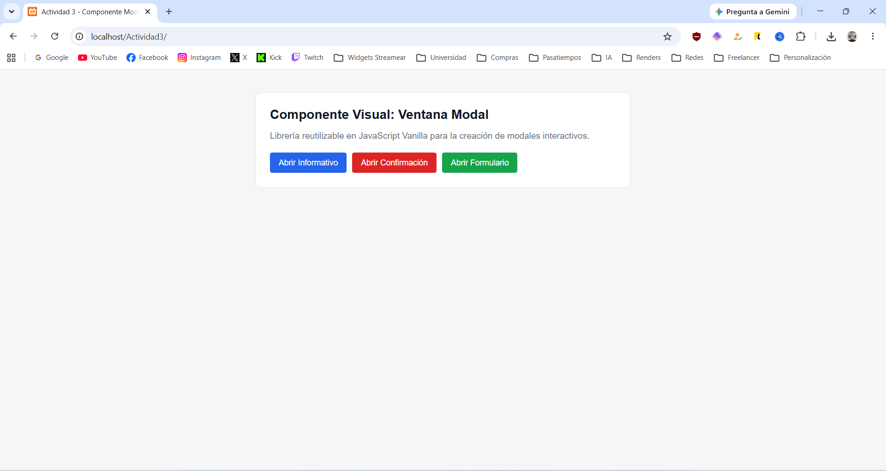

# Componente Visual: Ventana Modal en JS

**Alumna:** GARCIA CISNEROS JONATHAN JULIAN  
**Materia:** Programación Web  

## Descripción

Este proyecto contiene una librería liviana en JavaScript Vanilla para generar ventanas modales interactivas y dinámicas sin depender de librerías externas o frameworks.

Resuelve el problema de las alertas nativas del navegador (`alert()`, `confirm()`), permitiendo presentar información, confirmar acciones o capturar datos de usuario con una interfaz limpia y configurable.

## Estructura del Proyecto

```text
Actividad3/
├── css/
│   └── componente.css
├── js/
│   └── componente.js
├── img/
│   └── demo.png
├── index.html
└── README.md
```

## Captura de Pantalla


